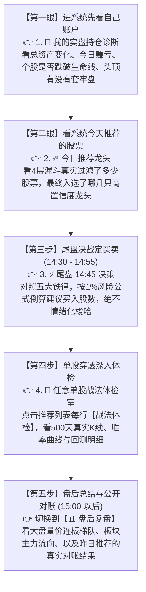

# 📘 股票量化协同操盘系统 · 终极保姆级实战使用说明书 (2026 最新版)

> **核心原则**：**不做黑盒，不选垃圾，尊重铁律，保住本金，知行合一。**  
> **实战动线**：**进门先看自己赚亏 ➔ 接着看推荐龙头 ➔ 尾盘定仓决策 ➔ 单股穿透体检 ➔ 盘后闭环对账。**

---

## 🧭 一、 双核心架构：两套系统，分工明确

系统顶栏设有极简双核胶囊切换器，根据交易时段与工作目标物理隔离：

```mermaid
graph LR
    System[股票协同操盘系统] --> Live[⚡ 实盘决策 (Live Trading)]
    System --> Review[📊 盘后复盘 (Post-Market Review)]
    
    Live --> L1[1. 💼 我的实盘持仓诊断]
    Live --> L2[2. 🔥 今日推荐龙头 - 4层漏斗]
    Live --> L3[3. ⚡ 尾盘 14:45 决策]
    Live --> L4[4. 🔬 任意单股战法体检室]
    Live --> L5[5. 🐦 推特大V异动雷达]

    Review --> R1[1. 📊 复盘总览看板]
    Review --> R2[2. 🌊 板块资金流向]
    Review --> R3[3. 🔗 逻辑归因图谱]
    Review --> R4[4. 📅 每日对账本]
    Review --> R5[5. 📰 情报证据库]
```

* **⚡ 实盘决策系统**：专门服务于 **09:15 ~ 15:00 盘中实操**。按操盘手直觉排布，助您管住双手、科学定仓、避开陷阱。
* **📊 盘后复盘中枢**：专门服务于 **15:00 以后与周末复盘**。全市场数据聚合、量化归因、对账验证、推演次日预案。

---

## 🚀 二、 操盘手黄金实战动线（每天先看什么、后看什么）

专业职业交易员每天的工作绝不是盲目追涨杀跌，而是像军队打仗一样严格按作息执行：



---

## ⚡ 三、 模块详解（系统一：实盘决策）

### 1. 💼 我的实盘持仓诊断（默认首选）
* **操盘逻辑**：任何合格操盘手，打开交易终端的第一件事永远是**看自己的账户和手中持仓安不安全**。
* **核心内容**：
  - **顶部 6 大真实资产概览条**：总资产、可用资金、股票市值、今日浮动盈亏、总浮动盈亏、仓位使用率（直连东财账户，拒绝静态假数字）；
  - **持仓列表与筹码天花板**：自动计算持仓标的距离上方 60 日最大筹码密集峰的距离，若头顶有重度套牢峰，会亮起红黄预警；
  - **一键直达单股体检**：点击持仓股旁边的 **`[🔬 体检]`** 按钮，秒级带入体检室查看该股 500 天走势与均线支撑。

### 2. 🔥 今日推荐龙头（4层漏斗核心观察池）
* **操盘逻辑**：看完自己持仓，第二件事就是看“系统今天帮我精选了哪些标的”。
* **100% 动态 4 层漏斗过滤关卡**：
  系统绝不在页面写死假数据，而是直连底层数据库 `funnel_logs` 流水动态更新：
  - **关卡 1 · 波动初筛**：实时展示【淘汰 XXX 只僵尸股】（全市场输入 ➔ 剩余输出）；
  - **关卡 2 · 排雷与流动性**：剔除 ST、退市风险及成交额低于 1.5 亿的流动性陷阱；
  - **关卡 3 · 筹码形态健康**：采用欧奈尔量价模型，换手率 2.5%~30%，均线多头突破；
  - **关卡 4 · 逻辑归因提纯**：四类互斥逻辑置信度检验，精炼入池 20~35 只。
* **快捷操作**：
  - 核心观察池表格按置信度由高到低降序排列；
  - 每一行右侧均有独立的绿色高亮 **`[🔬 战法体检]`** 按钮，点击一键无缝带入体检室。

### 3. ⚡ 尾盘 14:45 决策（实战总指挥部）
* **为什么一定要在 14:45 决战？**：
  上午 9:30~11:00 主力极度喜欢拉高诱多，散户追高极易吃套；下午两点半后多空博弈尘埃落定，主力骗线成本极高，大局已定。
* **实战决策流程**：
  1. 查看大势晴雨表：若大盘单边大跌超 1.0%，严控开仓；
  2. 观察筛选结果：
     - **情况 A（全军覆没）**：弹出金色的 **`[🛡️ 今日空仓防守勋章]`**。**操盘指令：坚决空仓！空仓就是最高级的防守！**
     - **情况 B（有黄金标的通关）**：点击标的卡片查看 **【📐 1% 风险算命定仓】**，系统根据止损价差直接计算**建议买入上限股数**，打开交易软件按该股数下单，绝不情绪化梭哈。

### 4. 🔬 任意单股战法体检室（500天真实行情回测）
* **解决痛点**：任何股票靠不靠谱、过去用这个战法能不能赚钱，用 500 天历史数据说话。
* **功能亮点**：
  - 支持全市场任意 A 股代码输入；
  - 实时绘制 **ECharts 专业行情图**（K线叠加 5/10/20/60 均线与买卖点标记）与 **资金净值曲线**；
  - 真实统计胜率、盈亏比、最大回撤与每一笔历史交易明细。

### 5. 🐦 推特大V异动雷达
* 监控全球知名对冲基金、顶级宏观分析师及美股科技产业链动态，为 A 股科技产业链提供外围先导参考。

---

## 📊 四、 模块详解（系统二：盘后复盘）

15:00 收盘后，点击顶栏右上角切换至 **`[📊 盘后复盘]`**：

### 1. 📊 复盘总览看板
* **顶部 4 大真实动态 KPI 胶囊卡片**：
  - **核心观察池**：当天真实入池数（如 25 只），与下方表格 100% 对齐；
  - **逻辑归因基底池**：Stage 2 排雷过滤后的基底池（如 354 只）；
  - **涨停收盘池**：当天真实收盘涨停标的数（如 78 只）；
  - **连板梯队龙头**：当天 2 板及以上的高度龙头数（如 15 只）。
* **连板空间梯队天梯图**：直观查看 4板+、3板、2板、首板的连板梯队高度。
* **组长复盘定调与次日推演**：AI 团队针对当天主力意图给出的次日博弈预案。

### 2. 🌊 板块资金流向（识别主力调仓方向）
* 展示 86 个行业板块的主力净流入排行与排头兵标的，看懂大资金是在进军算力半导体还是在防守银行红利。

### 3. 🔗 逻辑归因与产业链图谱
* 四大互斥归因：**连板土特产**、**美股异动指引**、**热点新闻驱动**、**活人资金建仓**，看清大涨标的的底层逻辑。

### 4. 📅 每日对账本（AI 推荐对账本）
* **绝无幸存者偏差**：每天盘后自动对齐昨日系统推荐标的的收盘涨跌、盈亏比与胜率，公开透明，闭环对账。

### 5. 📰 情报搜集与证据库
* 聚合官方快讯，支持一键筛选持仓关联资讯，动态呈现 SimHash 去重率与政策催化占比。

---

## 🏛️ 五、 操盘手五大交易铁律（最高宪法）

1. **铁律一【流动性底线】**：日成交额低于 1.5 亿元的死水股坚决不买！
2. **铁律二【大势共振律】**：大盘暴跌超 1.0% 时严禁开仓买入！
3. **铁律三【筹码天花板律】**：上方 10% 空间内有 60 日密集套牢峰的标的坚决不买！
4. **铁律四【盈亏比数学律】**：预期空间与止损风险比低于 2.5:1 的交易坚决不做！
5. **铁律五【华尔街 1% 风险律】**：单笔交易亏损严禁超过总账户资金的 1.0%！

---

## 📐 六、 华尔街 1% 单笔风险算命定仓公式

$$最大允许单笔亏损额 = 账户总资金 \times 1.0\%$$
$$单股止损风险价差 = 买入价格 - 防守止损价$$
$$建议买入股数 = \frac{最大允许单笔亏损额}{单股止损风险价差}$$

> **实战范例**：总资产 100 万元，1% 风险为 10,000 元。若标的市价 20 元，止损位设为 19 元（价差 1 元），则买入股数严格限制为 $10,000 \div 1 = 10,000$ 股（买入市值 20 万）。即便触及止损出局，账户也只损失 1%，保住绝对本金！

---

## 🛡️ 七、 空仓防守勋章的实战心法

* **会买的是徒弟，会卖的是师傅，会空仓的才是祖师爷**；
* 弱势震荡市中，市场上 80% 的大涨都是诱多假突破；
* 弹出空仓勋章代表今天市场不符合数学规律，**管住手就是最大的盈利！**

---

## 🚨 八、 常见问题与疑难排查（FAQ）

1. **东财直连显示异常？**
   - 点击顶栏右侧 **`[东财直连]`** 药丸或 **`[一键续Cookie]`** 按钮，根据提示粘贴最新东财网页端 Cookie 即可秒级恢复。
2. **4层漏斗卡片的数字为何每天不同？**
   - 因为本系统已实现 100% 数据库动态流水绑定，展示当天真实过滤掉的股票数量，彻底消灭了假数据。
3. **浏览器唤起机制？**
   - 系统内置单例防狂弹保护机制与 8 秒冷却锁，优先唤起 Chrome，异常时自动降级到 Firefox 或 Safari，绝不死循环抢占屏幕。
